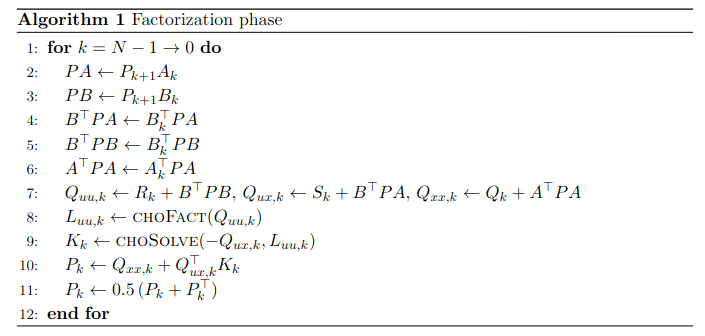
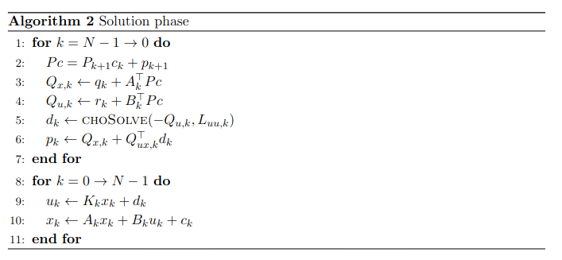

In this blog, we introduce the recursive method for solving the following LQR problem
$$
\begin{aligned}
    \min_{\bar{x}, \bar{u}} \quad &\sum_{k=0}^{N-1} \begin{bmatrix} q_k \\ r_k \end{bmatrix}^\top  \begin{bmatrix} x_k \\ u_k \end{bmatrix} 
    + \frac{1}{2} \begin{bmatrix} x_k \\ u_k \end{bmatrix}^\top
    \begin{bmatrix} Q_k & S_k^\top \\ S_k & R_k \end{bmatrix} 
    \begin{bmatrix} x_k \\ u_k \end{bmatrix} \\
    &\quad\quad + p_N^\top x_N + \frac{1}{2} x_N^T P_N  x_N \\
    \text{s.t.}\quad & x_{k+1} = A_k x_k + B_k u_k + c_k,\; k = 0, \dots, N-1,
\end{aligned}
$$
where $\bar{x} := \{ x_1, \dots, x_N \}$ and $\bar{u} := \{ u_0, \dots, u_{N-1} \}$. We consider the LQR problem as a quadratic program with equality constraints. The corresponding Lagrangian is then expresed as
$$
\begin{aligned}
\mathcal{L} (\bar{x}, \bar{u}, \bar{\lambda}) &= \sum_{k=0}^{N-1} \Bigg(
\begin{bmatrix} q_k \\ r_k \end{bmatrix}^\top  \begin{bmatrix} x_k \\ u_k \end{bmatrix} 
+ \frac{1}{2} \begin{bmatrix} x_k \\ u_k \end{bmatrix}^\top
\begin{bmatrix} Q_k & S_k^\top \\ S_k & R_k \end{bmatrix} 
\begin{bmatrix} x_k \\ u_k \end{bmatrix}
+ \lambda_{k+1}^\top \left(A_k x_k + B_k u_k + c_k - x_{k+1} \right) \Bigg) \\
&\quad\quad\quad + p_N^\top x_N + \frac{1}{2} x_N^T P_N  x_N,
\end{aligned}
$$
where $\bar{\lambda} = (\lambda_1, \cdots, \lambda_N)$ is a vector of Lagrange multipliers. The KKT conditions are derived as
$$
\begin{aligned}
\frac{\partial \mathcal{L}}{\partial \bar{x}} = 0,\;
\frac{\partial \mathcal{L}}{\partial \bar{u}} = 0,\;
\frac{\partial \mathcal{L}}{\partial \bar{\lambda}} = 0.
\end{aligned}
$$

For $k = 0$,
$$
\begin{aligned}
    0 &= r_0 + R_0 u_0 + S_0 x_0 + B_0^\top \lambda_{1}.
\end{aligned}
$$

For $0 < k <= N-1$,
$$
\begin{aligned}
    0 &= q_k + Q_k x_k + S_k^\top u_k + A_k^\top \lambda_{k+1} - \lambda_k , \\
    0 &= r_k + R_k u_k + S_k x_k + B_k^\top \lambda_{k+1}, \\
    0 &= A_{k-1} x_{k-1} + B_{k-1} u_{k-1} + c_{k-1} - x_k.
\end{aligned}
$$

For $k = N$,
$$
\begin{aligned}
    0 &= p_N + P_N x_N - \lambda_N , \\
    0 &= A_{N-1} x_{N-1} + B_{N-1} u_{N-1} + c_{N-1} - x_N.
\end{aligned}
$$

The corresponding KKT system $(N = 3)$ is then
$$
\begin{equation*}
    \left[
    \begin{array}{ccccccccc}
        R_0 & B_0^\top \\
        B_0 & & -I\\
        \hline
        & -I & Q_1 & S_1^\top & A_1^\top \\
        & & S_1 & R_1 & B_1^\top  \\
        & & A_1 & B_1 & & -I \\
        \hline
        & & & & -I & Q_2 & S_2^\top & A_2^\top \\
        & & & & & S_2 & R_2 & B_2^\top \\
        & & & & & A_2 & B_2 & & -I \\
        \hline
        & & & & & & & -I & P_3 
    \end{array}
    \right]
    \left[
    \begin{array}{c}
        u_0 \\
        \lambda_1 \\
        \hline
        x_1 \\
        u_1 \\
        \lambda_2 \\
        \hline
        x_2 \\
        u_2 \\
        \lambda_3 \\
        \hline
         x_3
    \end{array}
    \right] = 
    \left[
    \begin{array}{c}
        -r_0 - S_0 x_0 \\
        -A x_0 - c_0 \\
        \hline
        -q_1 \\  
        -r_1 \\
        -c_1 \\
        \hline
        -q_2 \\  
        -r_2 \\
        -c_2 \\
        \hline
        -p_3
    \end{array}
    \right]
\end{equation*}.
$$

Next, we recursively factorize the KKT matrix, starting from the last two stages:
$$
\begin{equation*}
    \left[
    \begin{array}{ccccccccc}
        -I & Q_{N-1} & S_{N-1}^\top & A_{N-1}^\top \\
        & S_{N-1} & R_{N-1} & B_{N-1}^\top \\
        & A_{N-1} & B_{N-1} & & -I \\
        \hline
        & & & -I & P_N 
    \end{array}
    \right]
    \left[
    \begin{array}{c}
        \lambda_{N-1} \\
        \hline
        x_{N-1} \\
        u_{N-1} \\
        \lambda_{N} \\
        \hline
         x_N
    \end{array}
    \right] = 
    \left[
    \begin{array}{c}
        -q_{N-1} \\  
        -r_{N-1} \\
        -c_{N-1} \\
        \hline
        -p_N
    \end{array}
    \right]
\end{equation*}.
$$

By adding the 4th row to the 3rd row multiplied by $P_N$, we can eliminate the 4th row and obtain
$$
\begin{equation*}
    \left[
    \begin{array}{ccccccccc}
        -I & Q_{N-1} & S_{N-1}^\top & A_{N-1}^\top \\
        & S_{N-1} & R_{N-1} & B_{N-1}^\top \\
        & P_N A_{N-1} & P_N B_{N-1} & -I
    \end{array}
    \right]
    \left[
    \begin{array}{c}
        \lambda_{N-1} \\
        \hline
        x_{N-1} \\
        u_{N-1} \\
        \lambda_{N}
    \end{array}
    \right] = 
    \left[
    \begin{array}{c}
        -q_{N-1} \\  
        -r_{N-1} \\
        -P_N c_{N-1} - p_N
    \end{array}
    \right]
\end{equation*}.
$$

To eliminate the 3rd row, we add it multiplied by $\textcolor{red}{A_{N-1}^\top}$ to the 1st row and add it multiplied by $\textcolor{blue}{B_{N-1}^\top}$ to the 2nd row, resulting in 
$$
\begin{equation*}
    \left[
    \begin{array}{ccccccccc}
        -I & Q_{N-1} + \textcolor{red}{A_{N-1}^\top} P_N A_{N-1} & S_{N-1}^\top + \textcolor{red}{A_{N-1}^\top} P_N B_{N-1} \\
        & S_{N-1} + \textcolor{blue}{B_{N-1}^\top} P_N A_{N-1} & R_{N-1} + \textcolor{blue}{B_{N-1}^\top} P_N B_{N-1} \\
    \end{array}
    \right]
    \left[
    \begin{array}{c}
        \lambda_{N-1} \\
        \hline
        x_{N-1} \\
        u_{N-1} 
    \end{array}
    \right] = 
    \left[
    \begin{array}{c}
        -q_{N-1} - A_{N-1}^\top (P_N c_{N-1} + p_N) \\  
        -r_{N-1} - B_{N-1}^\top (P_N c_{N-1} + p_N)
    \end{array}
    \right]
\end{equation*}.
$$

For notational simplicity, we use
$$
\begin{aligned}
Q_{xx,k} &= Q_{k} + A_k^\top P_{k+1}A_k\\
Q_{uu,k} &= R_{k} + B_k^\top P_{k+1}B_k\\
Q_{ux,k} &= S_{k} + B_k^\top P_{k+1}A_k \\
Q_{x,k} &= q_k + A_k^\top \left( P_{k+1} c_k + p_{k+1} \right)\\
Q_{u,k} &= r_k + B_k^\top \left( P_{k+1} c_k + p_{k+1} \right).
\end{aligned}
$$

We then represent $u_{N-1}$ in terms of $x_{N-1}$
$$
\begin{aligned}
Q_{ux, N-1} x_{N-1} + Q_{uu, N-1} u_{N-1} &= - Q_{u, N-1} \\
u_{N-1} &= - Q_{uu, N-1}^{-1} Q_{ux, N-1} x_{N-1} - Q_{uu, N-1}^{-1} Q_{u, N-1} \\
&:= K_{N-1} x_{N-1} + d_{N-1}.
\end{aligned}
$$
We also have
$$
\begin{aligned}
-\lambda_{N-1} + Q_{xx, N-1} x_{N-1} + Q_{ux, N-1}^\top u_{N-1} &= - Q_{x, N-1} \\
-\lambda_{N-1} + Q_{xx, N-1} x_{N-1} + Q_{ux, N-1}^\top (-Q_{uu, N-1}^{-1} Q_{ux, N-1} x_{N-1} - Q_{uu, N-1}^{-1} Q_{u, N-1}) &= -Q_{x, N-1}
\end{aligned}
$$

$$
\begin{aligned}
\lambda_{N-1} &= \left( Q_{xx, N-1} - Q_{ux, N-1}^\top Q_{uu, N-1}^{-1} Q_{ux, N-1}  \right) x_{N-1} + Q_{x, N-1} - Q_{ux, N-1}^\top Q_{uu, N-1}^{-1} Q_{u, N-1} \\
&:= P_{N-1} x_{N-1} + p_{N-1}.
\end{aligned}
$$

This indicates the relation between $\lambda_k$ and $x_k$, and it is not difficult to derive the submatrix to be factorized at stage $k$ 
$$
\begin{equation*}
    \left[
    \begin{array}{ccccccccc}
        -I & Q_{k} & S_{k}^\top & A_{k}^\top \\
        & S_{k} & R_{k} & B_{k}^\top \\
        & A_{k} & B_{k} & & -I \\
        \hline
        & & & -I & P_{k+1} 
    \end{array}
    \right]
    \left[
    \begin{array}{c}
        \lambda_{k} \\
        \hline
        x_{k} \\
        u_{k} \\
        \lambda_{k+1} \\
        \hline
        x_{k+1}
    \end{array}
    \right] = 
    \left[
    \begin{array}{c}
        -q_{k} \\  
        -r_{k} \\
        -c_{k} \\
        \hline
        -p_{k+1}
    \end{array}
    \right]
\end{equation*}.
$$
We can repeat the same procedure as above to factorize this submatrix until the initial stage. After the **factorization phase**, we use the computed matrices $K_k$ and $d_k$ to recover the optimal state and input trajectories. This is called the **solution phase**. The descriptions of the two algorithms are shown below.

  

  

Note that Line 11 in Algorithm 1 can improve the numerical stability. The methods $\texttt{choFact}$ and $\texttt{choSolve}$ compute the Cholesky decomposition and solve the linear system using the Cholesky factorization, respectively.